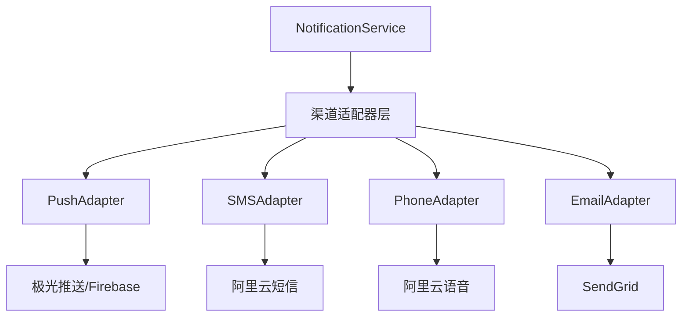
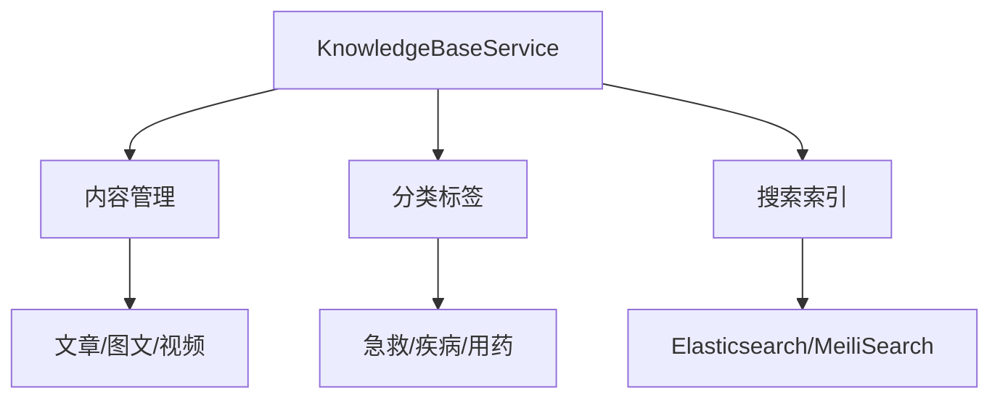
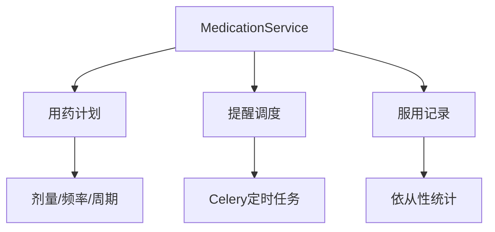

## 产品概述

基于PRD v1.1的下一步实施计划，聚焦于完成Phase 2剩余功能（真实第三方服务接入）和启动Phase 3核心功能开发。

## 当前状态

- Phase 1（MVP）已完成：用户系统、签到、SOS、联系人、健康档案
- Phase 2大部分完成：设备绑定、急救资源、通知基础框架
- 服务层重构完成：6个核心服务继承BaseService，427个测试通过
- 测试覆盖率：85%+

## 核心需求

1. **Phase 2 收尾**：将通知模拟器替换为真实第三方服务（极光推送、阿里云短信/语音、SendGrid邮件）
2. **Phase 3 启动**：实现急救知识库、AED地图、用药提醒等高价值功能
3. **架构完善**：完成剩余服务的BaseService重构（NotificationService、AnomalyService等）

## 技术栈

- **后端**：Python 3.11+ + FastAPI 0.104+
- **数据库**：PostgreSQL 15+ / SQLite（开发）
- **缓存**：Redis 7+
- **第三方服务**：极光推送(JPush)、Firebase、阿里云短信/语音、SendGrid邮件
- **测试**：pytest + pytest-cov

## 架构设计

### 通知服务架构

### 急救知识库架构

### 用药提醒架构

## 实施策略

### Phase 2 收尾策略

1. **适配器模式**：为每种通知渠道创建适配器接口，保持与现有模拟器相同的API
2. **配置驱动**：通过环境变量切换模拟器/真实服务，支持灰度发布
3. **熔断降级**：真实服务失败时自动降级到模拟器或备用渠道

### Phase 3 启动策略

1. **急救知识库**：先实现基础CRUD和分类，再接入搜索
2. **AED地图**：复用现有emergency_resource架构，扩展AED专用字段
3. **用药提醒**：基于Celery定时任务，与通知服务集成